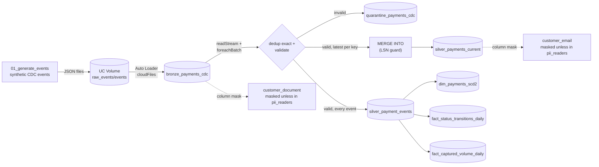
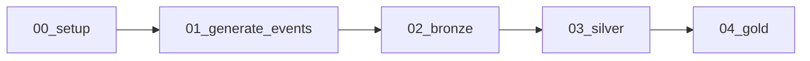

# databricks-cdc

[](https://github.com/FelipeDeMoraes19/databricks-cdc/actions/workflows/ci.yml)

End-to-end data pipeline on Databricks simulating Change Data Capture (CDC)
for a `payments` table, built in Python/PySpark following the medallion
architecture (bronze -> silver -> gold), with Unity Catalog, Auto Loader,
automated tests, and orchestration via Databricks Asset Bundles.

Built and deployed on Databricks Free Edition (serverless compute).

## Stack

- **Databricks** - Unity Catalog, Volumes, Auto Loader, Delta Lake, Jobs, Asset Bundles
- **Apache Spark / PySpark** - Structured Streaming, `foreachBatch`, `MERGE INTO`
- **Python** - transformation modules in `src/` tested with pytest, CI via GitHub Actions

## Structure

```
databricks.yml       Databricks Asset Bundle definition (dev/prod targets)
resources/           Asset Bundle job definitions
src/cdc_demo/        transformation code (bronze/silver/gold), testable outside Databricks
notebooks/           thin notebooks orchestrating the modules in src/ (00-05, run by the job)
notebooks/99_...     bonus notebook: Delta history, time travel, OPTIMIZE/ZORDER, Liquid Clustering
notebooks/archive/   first, exploratory batch version of the project, kept for reference
tests/               pytest tests for the functions in src/, run locally and in CI
.github/workflows/   GitHub Actions CI (pytest on every push/PR)
```

## Gold tables

- **`dim_payments_scd2`** - SCD Type 2 dimension built from `silver_payment_events`.
  One row per status transition, with `valid_from`/`valid_to`/`is_current`.
  A `DELETE` event produces a tombstone row (`is_current = true`,
  `is_deleted = true`) instead of a normal state.
- **`fact_status_transitions_daily`** - count of status transition *events* per
  day and status. A single payment contributes one row per status it passes
  through (e.g. PENDING, AUTHORIZED, CAPTURED), so this counts process
  throughput, not distinct payments or money.
- **`fact_captured_volume_daily`** - count and total `amount` of payments that
  reached `CAPTURED` status per day. This is the correct place to sum money:
  each payment reaches `CAPTURED` at most once, so the sum isn't inflated by
  earlier transitions (unlike grouping by status and summing `amount`, which
  would count the same payment's amount once per status it passed through).

## Governance (PII)

Each CDC event carries `customer_email` and `customer_document` (a synthetic
CPF with valid check digits). They're handled differently depending on the
layer:

- **Bronze** keeps both fields raw, like everything else in bronze (capture
  as-is from the source) - but `customer_document` is not left unprotected:
  it carries the same kind of Unity Catalog column mask as `customer_email`
  (a dedicated function, since a CPF has no `@domain` to fall back on -
  unauthorized readers get a fixed `***.***.***-**` instead of a partial
  reveal, since a national ID is more sensitive than an email address).
  **Intended production policy:** the column mask alone isn't the target
  state for a raw layer like bronze. In production this repo's design intent
  is a table-level `GRANT SELECT` restricting `bronze_payments_cdc` to an
  engineering group, with the column mask kept as an additional layer on top
  (defense in depth: even an engineer with legitimate bronze access
  shouldn't see a raw CPF in an ad hoc query without being in the PII group).
  This GRANT was not applied in this environment - there's no separate
  "engineering" group to test it against distinctly from `pii_readers`, and
  adding one just to demonstrate a GRANT felt like it would exercise nothing
  new. Documented here as intent, not as implemented.
- **Silver** replaces `customer_document` with `customer_document_hash`, an
  HMAC-SHA256 of the document. The HMAC key is never in the code: it lives in
  a Databricks secret (`databricks secrets create-scope databricks-cdc` /
  `put-secret databricks-cdc document_hmac_key`) and is read at runtime with
  `dbutils.secrets.get(...)` inside the `03_silver` notebook, then passed into
  `foreachBatch` as a plain string. The raw document is never written to
  silver, gold, or the quarantine table.
- **`customer_email`** is kept in clear text in the table, but protected with
  a Unity Catalog **column mask** (`notebooks/05_governance.py`): a SQL
  function checks group membership and returns the full email to members of
  an authorized group, or a masked value (`***@domain.com`) to everyone else.
  Verified end-to-end on Free Edition: querying `silver_payments_current` as
  a member of the authorized group returns the full address; removing that
  membership (`databricks groups patch ...`) makes the same query return the
  masked value a few dozen seconds later (group membership isn't
  instantaneous - Unity Catalog caches it briefly). The same
  member/non-member toggle was verified against `bronze_payments_cdc.customer_document`.

**Column masks disable time travel:** discovered while building the bonus
notebook (`99_delta_features_tour.py`) - querying `silver_payments_current
VERSION AS OF n` fails with `COLUMN_MASKS_FEATURE_NOT_SUPPORTED.TIME_TRAVEL`
once a column mask is applied to that table. The tour notebook demos time
travel against `silver_payment_events` instead, which carries no mask.

**Note on the masking function used:** the Unity-Catalog-recommended function
for this is `is_account_group_member()`, which checks *account*-level groups.
A group created through the CLI's workspace-level Groups API
(`databricks groups create`) was not recognized by it in this environment;
`is_member()` (the older, workspace-scoped check) worked instead, and is what
the mask functions in this repo actually use. Whether that's a genuine Free
Edition constraint, an account/workspace group federation quirk, or simply a
consequence of how the group was created here was not investigated further -
`is_member()` is just what worked in this environment, not a confirmed
platform limitation. Group creation itself is a one-time manual setup step
(create the group, add members) done outside the pipeline code, documented
here for reproducibility rather than automated in a notebook.

## Tests

`tests/` covers the pure Python event generator, the silver dedup/validation/
quarantine logic (including the exact scenario in
`tests/fixtures/cdc_scenario_batch.json`), the `MERGE` LSN guard (including a
delayed `DELETE`), idempotent `foreachBatch` writes, and the gold SCD Type 2 /
metrics builders - all against a local Spark + Delta session
(`tests/conftest.py`), not mocks. The local session sets
`spark.sql.ansi.enabled=true` to match Databricks serverless: without it, the
`.cast()`-vs-ANSI bug fixed in Fase 3 would pass locally and only surface on
Databricks.

```
pip install -r requirements-dev.txt
pytest
```

**Windows-only setup:** plain `pyspark` needs a Hadoop `winutils.exe` (and
`hadoop.dll`) on Windows even for local-only tests - without it the JVM
doesn't start. Downloaded from `cdarlint/winutils` on GitHub, `hadoop-3.3.6`
build (closest available to the `3.3.4` PySpark 3.5.3 actually bundles - no
`3.3.4` build exists in that repo), into `C:\hadoop\bin\`. SHA-256 of the
exact files used here, for anyone re-verifying before trusting them:

```
496a591eb1e67df2a620f710d529ba6ddfe1c19149e6647cc4e320bb0efd8553  winutils.exe
d7ab36a68518748cef142be2da5069b4c763c2cd764c1d2e6ac48c7200405be3  hadoop.dll
```

Then set:

```
set HADOOP_HOME=C:\hadoop
set PATH=%HADOOP_HOME%\bin;%PATH%
set PYSPARK_PYTHON=<full path to your python.exe>
set PYSPARK_DRIVER_PYTHON=<full path to your python.exe>
```

`PYSPARK_PYTHON` matters if `python`/`python3` on PATH could resolve to the
Windows Store alias instead of the real interpreter - Spark's worker
processes fail silently otherwise. Linux (including GitHub Actions) needs
none of this.

## Architecture



Orchestration (Databricks Job, deployed via Asset Bundle, daily schedule paused):



`05_governance` and `99_delta_features_tour` are run on demand, not part of
the scheduled job - the former is one-time DDL setup, the latter is a
Delta-features demo, not pipeline logic.

## Technical decisions

- **Streaming ingestion, not batch polling.** Auto Loader (`cloudFiles`) with
  `trigger(availableNow=True)` processes whatever landed in the Volume since
  the last checkpoint and stops - cheap and simple to run as a scheduled job,
  without keeping a cluster alive 24/7.
- **LSN over `updated_at` for conflict resolution.** A Postgres-style LSN
  only grows and is assigned by the source itself; `updated_at` can repeat,
  suffer clock skew, or be missing on a `DELETE`. Every dedup step and the
  `MERGE` guard key off `lsn`, never off time.
- **Explicit bronze schema + rescued data column**, not schema inference.
  A field Auto Loader doesn't expect (or a value that doesn't match) lands in
  `_rescued_data` instead of silently breaking the read or getting dropped.
- **`try_cast`/`try_to_timestamp`, not `.cast()`/`to_timestamp()`.** Found the
  hard way in Fase 3: this Databricks serverless runtime has ANSI SQL mode
  on, where `.cast()` *throws* on bad input instead of returning `null`. That
  silently broke the quarantine logic (an invalid row would crash the whole
  micro-batch instead of being isolated) until this was caught. The local
  test suite pins `spark.sql.ansi.enabled=true` specifically so this class of
  bug can't regress without a local test failing first.
- **Validate before deduplicating to "latest".** Also from Fase 3: if the
  *newest* event for a key in a micro-batch is invalid, deduplicating first
  would silently drop the last *valid* event for that key too - it would
  never reach quarantine or silver. Validation runs first; "keep the latest"
  only ever chooses among already-valid rows.
- **Two dedup levels serving two different tables.** `silver_payment_events`
  (history, append-only) gets every validated and exact-deduplicated event -
  needed so SCD2 doesn't lose an intermediate status transition that happened
  to land in the same micro-batch. `silver_payments_current` only gets the
  latest-per-key row, since it's a `MERGE` target representing current state.
- **Idempotent `foreachBatch` writes via `txnAppId`/`txnVersion`.** `foreachBatch`
  is at-least-once: a retried micro-batch must not double-write. Delta's
  built-in idempotent-write option (keyed by `batch_id`) handles this instead
  of a hand-rolled dedup-on-write. Verified by replaying the same `batch_id`
  three times and asserting the row count only grew once.
- **Gold recomputed in full, not merged incrementally.** SCD2 needs the
  complete ordered history per key to derive `valid_from`/`valid_to`
  correctly; an incremental `MERGE`-based SCD2 would need to also patch the
  previous "current" row's `valid_to` on every new event, which is
  meaningfully more complex than overwriting a still-small gold table from
  the full history log on every run.
- **Metrics semantics kept explicit and separate.** Summing `amount` grouped
  by status double-counts a payment across every status it passed through.
  `fact_status_transitions_daily` (counts) and `fact_captured_volume_daily`
  (the only safe place to sum money) exist as separate tables instead of one
  ambiguous one.
- **Free Edition has one workspace**, so `dev`/`prod` in the Asset Bundle are
  a logical separation (different schema, `payments_cdc_dev` vs
  `payments_cdc`) rather than physically separate workspaces.
- **HMAC hash for the document, column mask for the email.** A document
  number has no legitimate reason to ever be displayed again after capture,
  so an irreversible hash (keyed by a Databricks secret, not a code constant)
  is appropriate. An email may legitimately need to be shown in full to an
  authorized role, which a hash can't do - a reversible-by-permission column
  mask fits that case instead.

## How to run

```bash
databricks auth login --host <your-workspace-url>

databricks bundle validate -t dev
databricks bundle deploy -t dev
databricks bundle run cdc_pipeline -t dev
```

`05_governance` isn't part of the scheduled job (it's one-time DDL) - run it
once per target after the first deploy, from the Databricks UI or:

```bash
databricks jobs submit --json '{
  "run_name": "governance-setup",
  "tasks": [{"task_key": "governance", "notebook_task": {
    "notebook_path": "<bundle files path>/notebooks/05_governance",
    "base_parameters": {"catalog": "workspace", "schema": "payments_cdc_dev"}
  }}]
}'
```

Swap `-t dev` for `-t prod` (and the schema above) to deploy the production
target - see [Governance](#governance-pii) for why `customer_document` also
needs `05_governance` re-run on bronze after any schema reset.

Local tests: see [Tests](#tests) above.

## Results

Numbers from a clean run against the `prod` target (`payments_cdc` schema)
after resetting all tables:

| Table | Rows | Notes |
|---|---:|---|
| `bronze_payments_cdc` | 140 | 122 distinct events + 18 duplicated on purpose |
| `silver_payments_current` | 40 | one row per payment (current state) |
| `silver_payment_events` | 122 | full validated history, no data loss across dedup |
| `quarantine_payments_cdc` | 0 | clean synthetic batch, nothing invalid |
| `dim_payments_scd2` | 122 | 1:1 with the history log |
| `fact_captured_volume_daily` | 31 captured, $67,510.30 | matches the 31 `CAPTURED` rows in the dimension |

Governance, verified by toggling the tester's own membership in `pii_readers`
via `databricks groups patch` and re-querying:

| Query as | `silver_payments_current.customer_email` | `bronze_payments_cdc.customer_document` |
|---|---|---|
| Group member | `customer1@example.com` | `433.218.196-43` |
| Not a member | `***@example.com` | `***.***.***-**` |

## Screenshots

_(space reserved - to be filled in manually)_

- **Job DAG** - Databricks UI, Workflows → `databricks-cdc-pipeline` → any
  run → Graph view (shows `setup → generate_events → bronze → silver → gold`).
- **Successful run** - the same run's page with every task green, plus the
  duration.
- **Unity Catalog lineage** - Catalog Explorer → `workspace.payments_cdc.silver_payments_current`
  → Lineage tab (shows bronze → silver → gold flowing through this table).
- **Mask before/after** - two query results side by side against
  `silver_payments_current` or `bronze_payments_cdc`: once while a member of
  `pii_readers`, once after `databricks groups patch` removes that
  membership (allow it a minute or two to propagate, as noted above).
